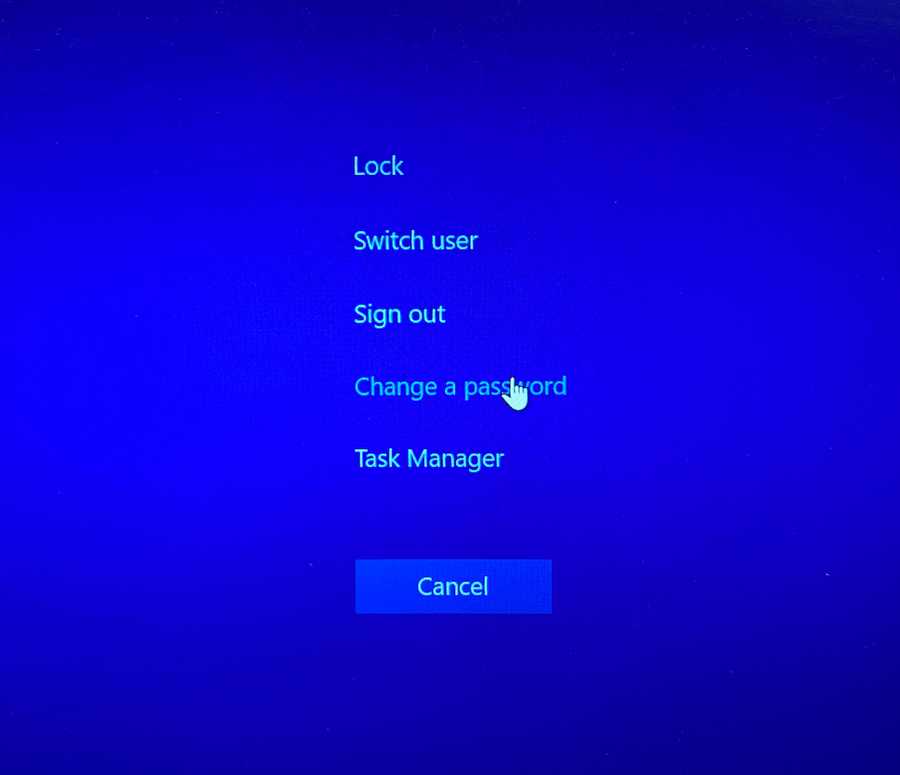

# Guide for a SmartCard User Logon In AD (Active Directory)

**This writeup guides you how to authenticate yourself on a Windows server 2019 with a SmardCard**

## Step 1. Create a user in AD [1]

## Step 2. Manage certificates for SmartCard user

Choose the name for the template certificate

Give, Read/Write/Enroll permissions to both Authenticated and Administrators users

Finally configure Issuance Requirements

## Step 3. Enable Enrollment Agent certificate 

## Step 4. Add Enrollment Agent certificate in personal certificates 
First You have to open a certification manager utility by typing certmgr.msc in RUN and then you can request a new certificate

Enroll "Enrollment agent" certificate

Final result

## Step 5. Enroll a certificate for a SmartCard user [1]. 

Click Next

Click Next

Click Browse and accept certificate for Certificate Request Agent

Click Next

Select the SmartCard user duplicate certificate you created and click Next

Select the test user you created for the certificate and click Enroll

Connect your SmartCard

Enter your SmartCard PIN, which should be 0000 by default

Finally you can change the SmartCard PIN by hitting ctlr+alt+delete and then changing a password ( Special thanks to Nikita )

**THE END!**

## References

1. https://www.youtube.com/watch?v=zuOnoM6kfZY&t=1s&ab_channel=Tech%26ComputerStuff