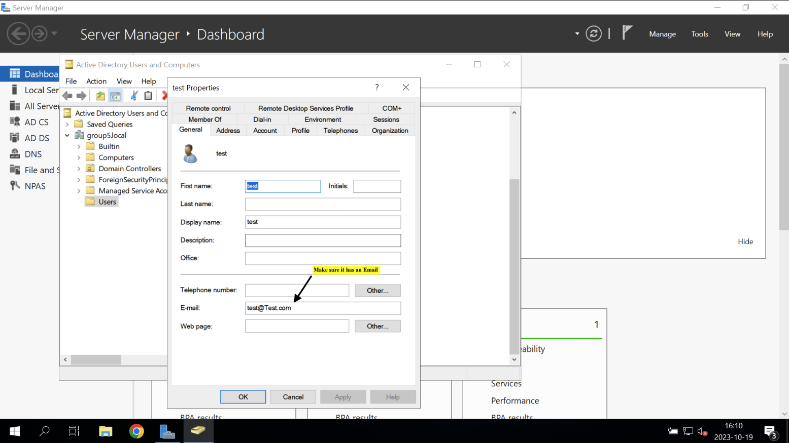

# Guide for a SmartCard User Logon In AD (Active Directory)

## Step 1. Create a user in AD

## Step 2. Manage certificates for SmartCard user

Choose the name for the template certificate

Give Read, Write and Enroll permissions to both Authenticated users and Administrators

Finally configure Issuance Requirements

## Step 3. Enable Enrollment Agent certificate 

